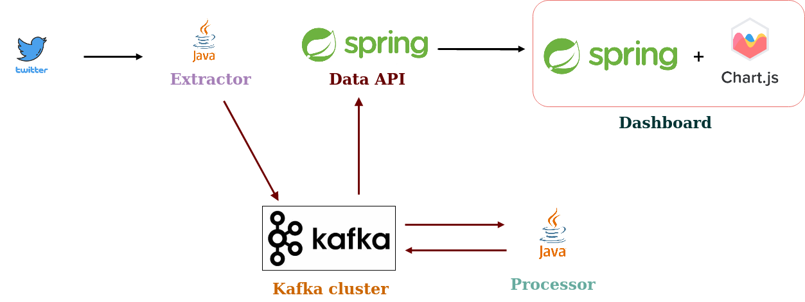

# Overview

-- GIF of dashboard is here followed by description

Summarize the functional requirements...
Describe what the graph is showing....

# Project Layout

This is a multi-module Maven project that consists of five(5) module:

* [Common](common/README.md)
* [Extractor](extractor/README.md)
* [Processor](processor/README.md)
* [Data API](data-api/README.md)
* [Dashboard](dashboard/README.md)
     
# Architecture



* [Extractor](extractor/README.md) uses Twitter's 
[Filtered Stream API](https://developer.twitter.com/en/docs/labs/filtered-stream/overview)
to consume a stream of tweets that contain any of the following strings used to reference the global pandemic of 2020: 
"Coronavirus", "Wuhan Virus", "Chinese Virus", "COVID-19", "SARS-CoV-2". For each non-repeating occurrence of one the
target strings in a tweet, `extractor` sends a `tweet_data` object to a Kafka 'input topic' using the string as the 
record's key.

* [Processor](processor/README.md) is a Kafka Streams application that streams records from the input topic and
 merges them into stateful `tweet_aggregate` objects based on their keys. `tweet_aggregate`s are then written to the
 output topic.
 


* [Data API](data-api/README.md) is a Spring Boot web application. It polls the output topic and builds data
packages which are sent to [Dashboard](dashboard/README.md) in a stream of server-sent events. `Dashboard` is a Spring
Boot web application which serves a frontend containing a bar chart created with [Chart.js](https://www.chartjs.org/) 
and opens a connection to the API using JavaScript's `EventSource` interface. The bar chart is updated as new
messages arrive in the stream.

# How to deploy locally

##### Prerequisites:

* Reliable internet connection
* JDK 1.8+
* Apache Zookeeper and Apache Kafka(v2.4.0 at least)    
* Maven 3
* A Maven profile(defined in {USER_HOME}/.m2/settings.xml) with the properties shown in the example below:

```xml
<profile>
<id>name_of_profile</id>
	
 <properties>
    
         <!-- Twitter API Keys -->
	<twitter.consumer.key>TWITTER_KEY</twitter.consumer.key>
	<twitter.consumer.secret>TWITTER_SECRET</twitter.consumer.secret>
		
	<kafka.processor.id>processor</kafka.processor.id>
	<kafka.extractor.id>extractor</kafka.extractor.id>
	<kafka.acks>all</kafka.acks>
	<kafka.bootstrap.servers>localhost:9092</kafka.bootstrap.servers>

         <!-- These Kafka topics have to be created manually and can be named differently -->
	<kafka.output.topic>processed-tweet-data</kafka.output.topic>
	<kafka.topic.input>raw-tweet-data</kafka.topic.input>

	<data.api.port>8087</data.api.port>
	<dashboard.port>8084</dashboard.port>

        <!-- Base URL of the Data API -->
	<data.api.url>http://localhost:8087</data.api.url>

  </properties>	
</profile>
```

* You'll also need access to Twitter's Filtered Stream API which is only available in the Twitter Developer Labs
program as of August 2020.

##### Steps:

* Start Zookeeper and Kafka then `cd` to the project root and execute the following commands:

```shell script
mvn clean install -Pname_of_profile                  # Builds all modules of the project     
cd extractor
java -jar target/extractor-1.0.0-SNAPSHOT.jar        # Starts the extractor program
cd ../processor 
java -jar target/processor-1.0.0-SNAPSHOT.jar        # Starts the Kafka Streams program
cd ../data-api
java -jar target/data-api-1.0.0-SNAPSHOT.jar         # Starts the data API service
cd ../dashboard
java -jar target/dashboard-1.0.0-SNAPSHOT.jar        # Starts the dashboard application
```
* Open a browser and load `http://localhost:{DASHBOARD_PORT}/dashboard`

# Tech Stack

* JDK 1.8
* Spring Boot
* Apache Maven
* JUnit 5
* Mockito 2
* Apache Kafka (and Zookeeper of course)
* Thymeleaf
* JavaScript
* Chart.js
